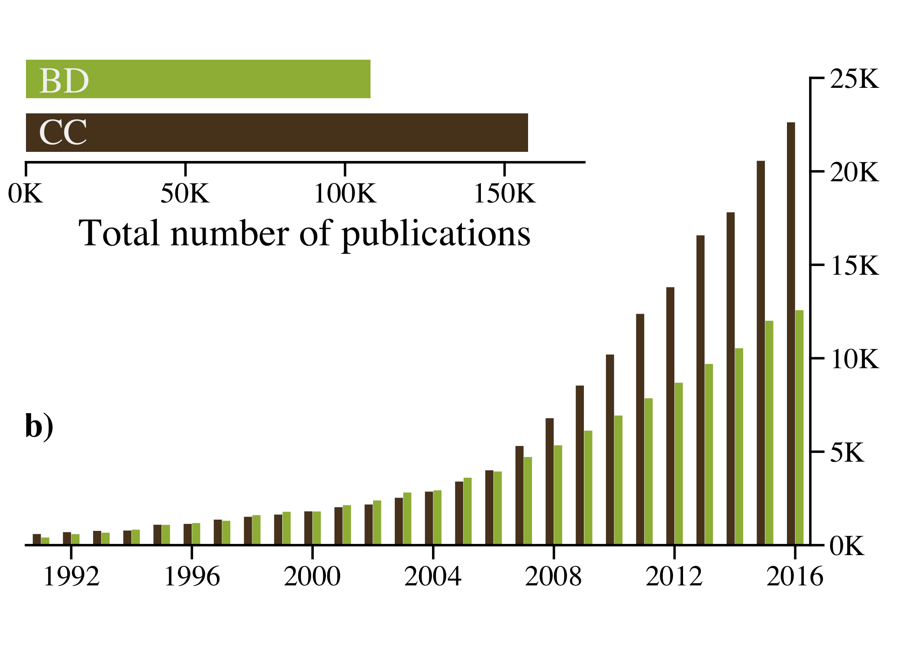

```{r dsetup, results = hide, echo = FALSE, message = FALSE}
knitr::opts_chunk$set(
  fig.align='center',
  tidy=FALSE,
  comment=R>> ,
  size = 'small'
)
```

## Briefly, what's a DOI?

- DOI for `Digital object identifier`
- _Unique identifier_ for digital objects (movies to scientific articles)
- At publication stage, each publishers has the responsability to ask for a DOI
- `ISO 26324:2012`

# Retrieve data from DOI

## How can I take advantage of DOI?

- [crossref](https://www.crossref.org/) offers web service to retrieve metadata from DOI.
- [rcrossref](https://github.com/ropensci/rcrossref) is a R package based on this web service.


## Retrieve data

### Install the package

```r
install.packages('rcrossref')
```

```{r}
library('rcrossref')
vecDOI <- c('10.1111/brv.12359','10.1649/0010-065X-68.2.343','10.1890/14-1858.1')
```

## Get the bibtex from DOI

### `Bibtex` is a suitable format (supported by Mendeley) which contains all the metadata of an article.

```{r}
bib1 <- cr_cn(vecDOI[1], format='bibentry', style = "apa")
str(bib1)
```

### Diverse format available:

rdf-xml, turtle, citeproc-json, citeproc-json-
ish, text, ris, bibtex (default), crossref-xml, datacite-xml,bibentry,
or crossref-tdm

## Get the bibtex from DOI

### Looping of the DOI vector

```{r}
lsf <- lapply(vecDOI, cr_cn, format=bibentry)
nlevels(lsf)
```

## Get the author of each articles

```{r}
lsaut <- lapply(lsf, function(x) x$author)
lsaut[1]
```

## Get the journal of each articles

```{r}
lsjnl <- lapply(lsf, function(x) x$journal)
lsjnl[1]
```

## Perform queries

```{r}
cr_cn(query="biodiversity")
```

## Bibliometric studies


